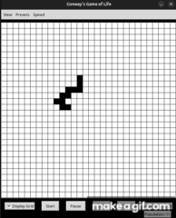

# Conway-Game-of-Life

[Watch the video](./video/demo.mp4)

## Description

- [Conway's Game of Life](https://en.wikipedia.org/wiki/Conway%27s_Game_of_Life) is a cellular automaton devised by mathematician John Horton Conway. 
- It simulates the evolution of cells on a grid based on a set of rules.
- Each cell can either be alive or dead, and its state in the next generation depends on its neighbors.
- This implementation allows users to visualize the grid's evolution over time based on the initial configuration.

## Rules of the Game
- Any live cell with fewer than two live neighbors dies (underpopulation).
- Any live cell with two or three live neighbors survives.
- Any live cell with more than three live neighbors dies (overpopulation).
- Any dead cell with exactly three live neighbors becomes a live cell (reproduction).

## Features
- Configurable grid size.
- Customizable initial configuration (user-defined patterns).
- Visual representation of the grid and cells.
- Adjustable speed for generation updates.
- Pause/Play functionality.

## Usage

- **Start/Stop**: Press the `Start` button to begin the simulation, and the `Pause` button to stop it.
- **Clear** : Press the `Clear` button to reset the entire grid.
- **Next:** Press `Next` button to jump to next generation.
- **Speed Control**: Use the speed slider to adjust the speed of the simulation.
- **Custom Configuration**: You can set up your own initial configuration by clicking on cells to toggle between alive and dead states.
- **Display Grid**: Press ``Display Grid`` widget in order to enabled/disable grid outline.
- **View**: Select the `View` menu to check Game Rules and History of the game.
- **Presets**: Presets menu allows to load presets patterns to the grid.

